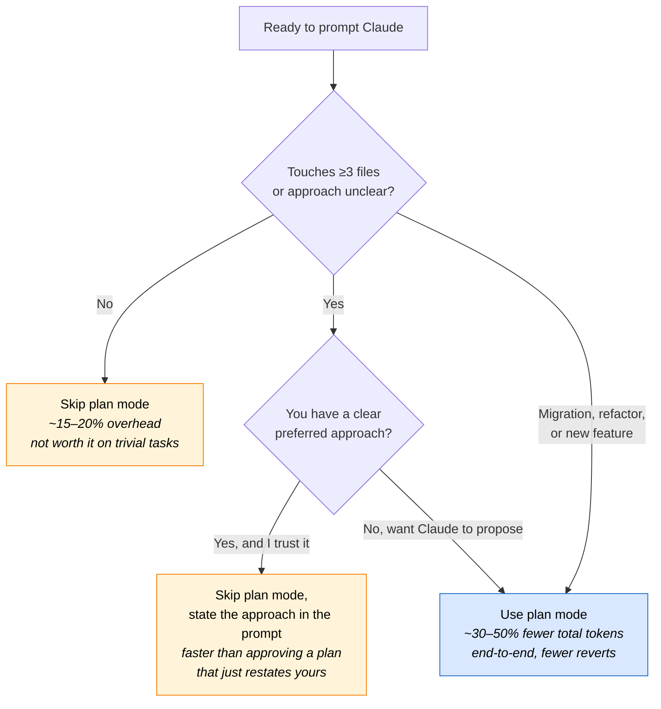

# Decision Trees

Fast, visual answers to the two questions people ask most often when they
start using Claude Code: *which model?* and *plan mode when?* Each tree is
deliberately small — if the decision is nuanced, the tree points you to the
deeper guide.

These render as Mermaid diagrams on the [published
site](https://MuhammadUsmanGM.github.io/claude-code-best-practices/) and on
GitHub. If you're reading in a terminal or a viewer without Mermaid support,
scroll past the diagram for the plain-text version.

## Which model should I use?

```mermaid
flowchart TD
  Start["New task in Claude Code"] --> Q1{Mechanical edit?<br/>(format, rename in one file,<br/>obvious boilerplate)}
  Q1 -->|Yes| Haiku["Haiku<br/><i>cheap, fast, single-file</i>"]
  Q1 -->|No| Q2{Touches ≥3 files<br/>or hard to debug?}

  Q2 -->|No| Q3{Reasoning-heavy?<br/>(architecture, novel algorithm,<br/>security-sensitive)}
  Q3 -->|No| Sonnet["Sonnet<br/><i>default for most work</i>"]
  Q3 -->|Yes| Opus["Opus<br/><i>plan mode, deep debugging,<br/>risk analysis</i>"]

  Q2 -->|Yes| Q4{First attempt<br/>likely to need rework?}
  Q4 -->|No| Sonnet
  Q4 -->|Yes| Opus

  style Haiku fill:#d9f0d9,stroke:#2e7d32,color:#000
  style Sonnet fill:#d9e8ff,stroke:#1565c0,color:#000
  style Opus fill:#f3d9ff,stroke:#6a1b9a,color:#000
```

### Plain-text fallback

1. **Mechanical edit in one file?** → Haiku. Stop.
2. **Touches ≥ 3 files OR hard to debug?**
   - **No, but reasoning-heavy?** → Opus.
   - **No and routine?** → Sonnet.
   - **Yes, and rework is likely?** → Opus.
   - **Yes, but shape is clear?** → Sonnet.

### Why this shape

- Haiku wins on tight, localized edits because the recovery cost from a
  partial fix is low — if it misses, you spot it instantly.
- Sonnet is the cost-quality frontier for 5 out of 6 tasks in the
  [benchmark set](benchmarks.md). It's the right default.
- Opus earns its premium on reasoning depth (migrations, risk analysis,
  architecture) and on tasks where *not* getting it right the first time
  costs more than the model premium would.

Cross-refs: [Performance Tuning](performance-tuning.md) · [Benchmarks](benchmarks.md) · [Cost Management](cost-management.md)

---

## Should I use plan mode?



### Plain-text fallback

Use plan mode when the task **touches ≥ 3 files** *or* **you don't yet know
the best approach**. Skip it when the change is local and obvious, or when
you already have a preferred approach you can state in one sentence.

### The break-even rule

Plan mode adds ~15–20% overhead on trivial tasks but *saves* 20–30% on
tasks that would otherwise need rework. The break-even is roughly "touches
≥ 3 files" or "approach non-obvious." See [Benchmarks](benchmarks.md) for
the numbers this rule is calibrated from.

### Common mistakes

- **Using plan mode for one-line fixes.** You pay the overhead, get no
  benefit.
- **Rubber-stamping the plan.** If Claude's plan isn't what you wanted,
  say so before approving. The whole point is to cheaply correct direction
  before any code moves.
- **Skipping plan mode on migrations.** Migrations are the highest-value
  plan-mode case — the cost of getting a deprecation wrong compounds across
  every affected file.

Cross-refs: [Workflow Patterns](workflow-patterns.md) · [Prompt Tips](prompt-tips.md) · [Benchmarks](benchmarks.md)

---

## See also

- [Performance Tuning](performance-tuning.md) — deeper coverage of model
  selection criteria than the tree above
- [Benchmarks](benchmarks.md) — the numbers that calibrate both trees
- [Workflow Patterns](workflow-patterns.md) — when plan mode fits inside a
  larger workflow
- [Anti-Patterns Gallery](anti-patterns.md) — AP-11 through AP-14 cover
  prompt failures that plan mode can catch early
